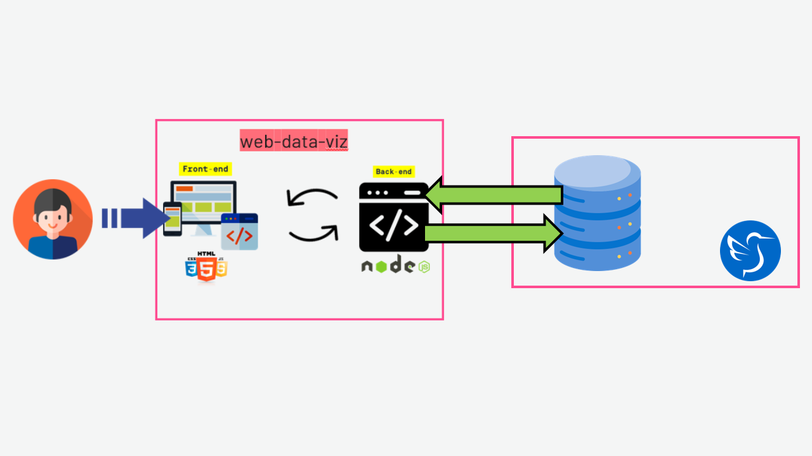
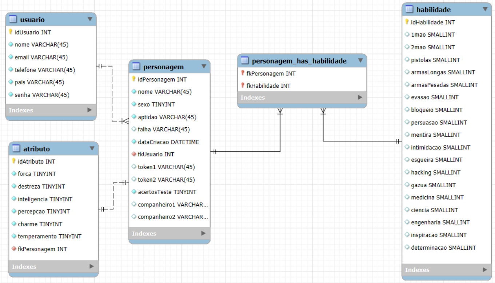
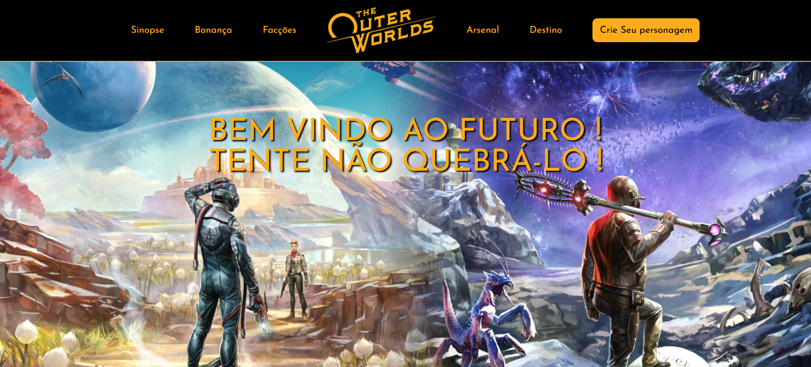
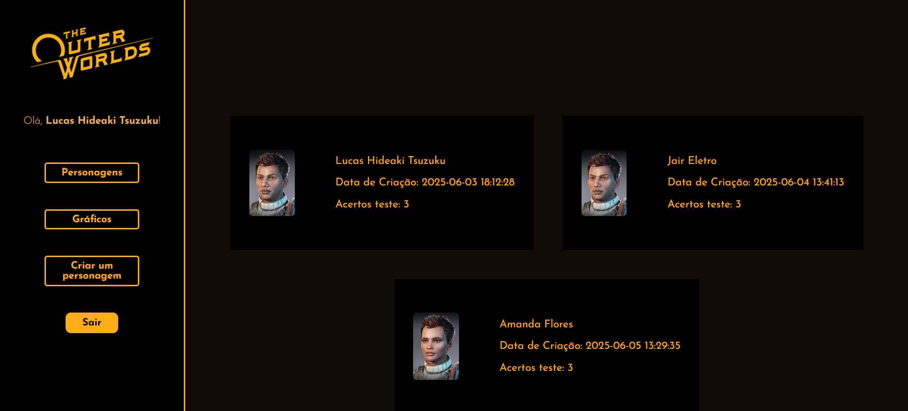
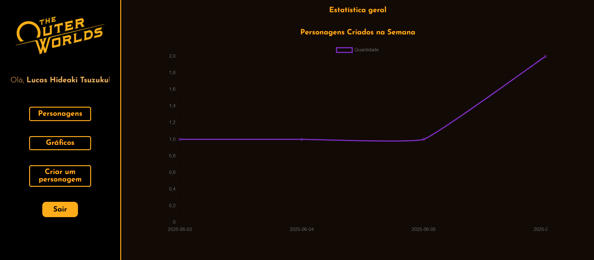

# Projeto individual 🚩

Projeto individual da SPTECH

## Objetivo 📜

Desenvolvimento de um website com formulário de cadastro

- Tema que represente você ou algo de seu gosto

- Utilizar HTML, CSS, e validações de formulários em JavaScript

- Aplicação da API NodeJS para cadastro e/ou consulta no banco de dados

- Foco no aprendizado individual e aplicação das disciplinas técnicas do semestre.

Figura 1: Esquema do projeto individual

## Ferramentas e tecnologias 👨‍💻

- HTML
- CSS
- JavaScript

## Passo a Passo 👣

- Criar repositório Github
- Fazer o planejamento no trello
- Protótipo do site com Figma
- Modelo lógico Banco de Dados
- Início Documento do projeto
- Planejamento implementação cadastro
- Adaptação Protótipo
- Criação de comandos SQL para testes e modelagem
- Avaliação modelagem
- Montagem básica do site
  - index
  - login
  - Criação Personagem
  - Sobre mim
  - Dashboard Geral
  - Dashboard Personagem
- Aplicações cálculos dashboard
- Ajustes dashboard
- VM com banco de dados
- Contexto e Planejamento
- Planilha de riscos
- Valores ONU
- Documento do projeto
- DESAFIO: fazer teste do personagem
- Apresentação

## Resultados 🎁

Figura 2: Modelagem BDurubu100

Figura 3: Página inicial Outer Worlds

Figura 4: Página personagens criados

Figura 5: Página dashboard

<!-- | Job | Company | Contribution Period |Tasks|
|-------|---------|-----------------------|-------|
IT Technician | H2 informática|2 years and 10 months | Remote or in-person technical support |
 -->

## Referências 📚

- https://trello.com/b/1VHaJzbb/sptechprojetoindividual
- https://outerworlds.obsidian.net/en
- https://github.com/BandTec/web-data-viz

## Atualizações 🕐

- 10/06/2025 - Primeira Versão

## Pendências 🚨

- Colocar estatísticas fltrado por Grupo ou País
- Funcionalidade para enviar resultados para o email cadastrado
- Ajustes estéticos
- Mais testes de validação
